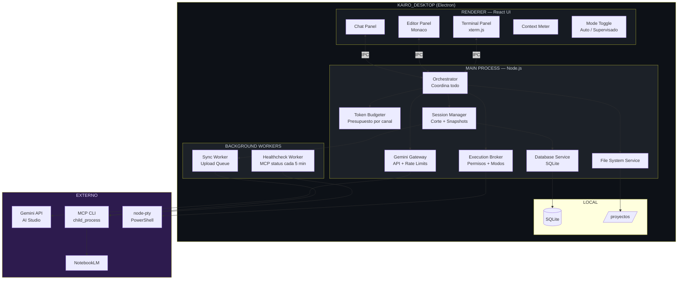
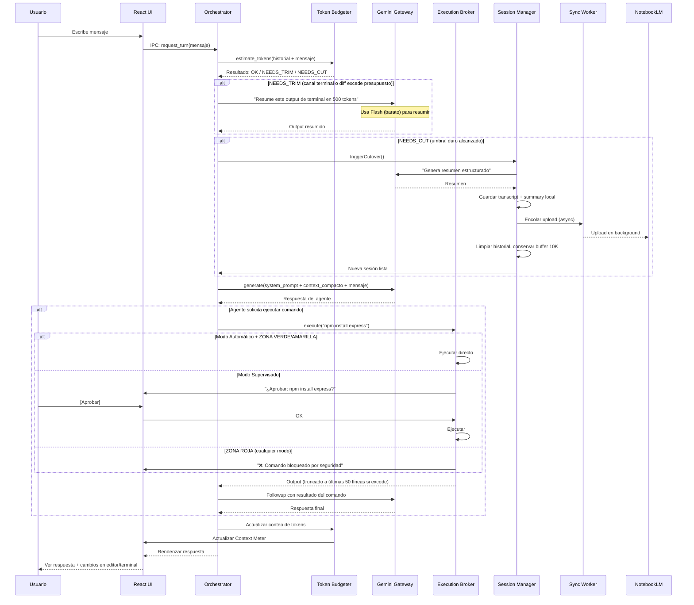
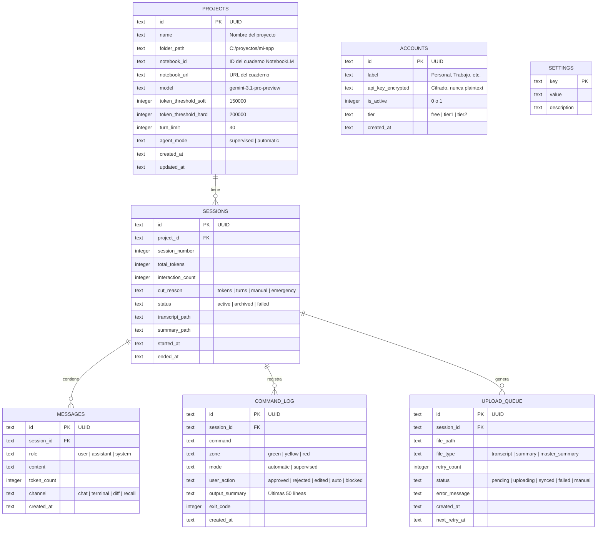
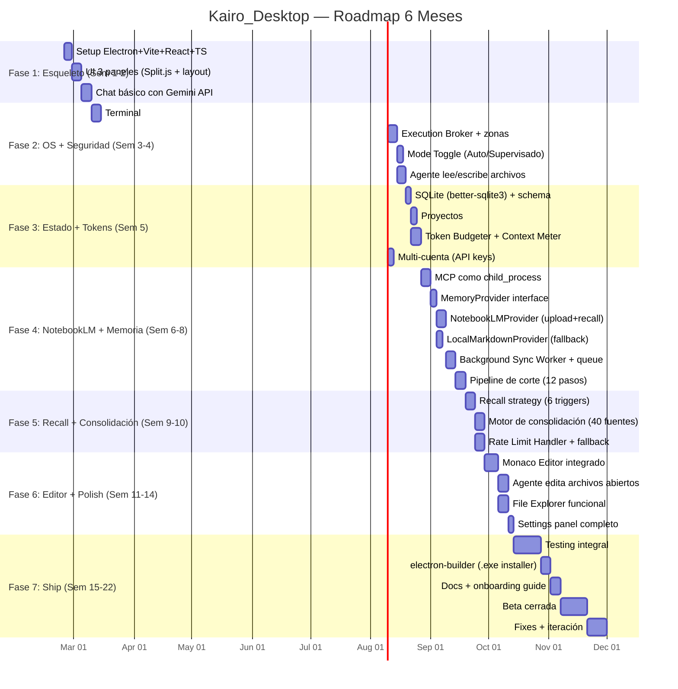

# KAIRO_DESKTOP — PRD FINAL (CONSOLIDACIÓN MAESTRA)
## Documento de Requisitos del Producto — Versión Definitiva
## Claude Architect + Gemini Architect + Nexus (ChatGPT)
### Fecha: 24 de Febrero 2026 | Post-Debate Rondas 1, 2 y Cierre Final

---

# ESTADO: ✅ ARQUITECTURA APROBADA — LISTO PARA IMPLEMENTAR

**Nivel de Contexto: 100%**
**Debates cerrados: TODOS**
**Decisiones del usuario: 17/17 confirmadas**
**Consenso entre 3 modelos: Total**
**Versión: 3.0 (FINAL — incorpora Multi-Model Routing, Tool Schema, Workspace Sandbox)**

---

# ÍNDICE

1. Visión del Producto
2. No-Objetivos (fuera de scope del MVP)
3. Decisiones Cerradas (inmutables)
4. Stack Tecnológico Definitivo
5. Política de Corte — CONSENSO FINAL v3
6. Context Budgeter por Canales
7. Arquitectura del Sistema (incluye Multi-Model Routing)
8. Layout UI — 3 Paneles
9. Modo Dual: Automático vs Supervisado (incluye Kill Switch)
10. Execution Broker — Clasificación + Workspace Sandbox
11. MemoryProvider — Sistema Pluggable
12. Estrategia de Consulta a NotebookLM
13. Motor de Consolidación de Fuentes
14. Multi-cuenta y Rate Limit Handling
15. Modelo de Datos (SQLite)
16. Tool Schema — Catálogo de Herramientas del Agente
17. System Prompt del Agente (Motor de Estados)
18. Estructura de Carpetas
19. Roadmap (6 meses)
20. Riesgos y Mitigaciones
21. Testing Strategy
22. Criterios de Aceptación del MVP

---

# 1. VISIÓN DEL PRODUCTO

**Kairo_Desktop** es un IDE de escritorio para Windows que combina un agente IA autónomo (Gemini 3.1 Pro) con memoria persistente infinita apalancada en Google NotebookLM.

**Diferenciador nuclear:** El agente nunca pierde contexto. Cada sesión se archiva automáticamente en NotebookLM, permitiendo al agente consultar todo el historial del proyecto sin saturar su ventana de contexto. El resultado: un asistente de desarrollo que recuerda cada decisión, cada error, cada línea de código — para siempre.

**Uso:** Personal primero, productización a 6 meses.
**Un solo proyecto activo a la vez.**

---

# 2. NO-OBJETIVOS (fuera de scope del MVP)

Acordado por los 3 modelos:

- ❌ Marketplace de extensiones (tipo VS Code / Theia)
- ❌ Colaboración multiusuario en tiempo real
- ❌ Cloud sync de proyectos (solo local + NotebookLM)
- ❌ Soporte multi-OS (solo Windows 11 para MVP)
- ❌ Gestión de pagos/billing de Gemini (el usuario lo maneja externamente)
- ❌ Múltiples proyectos abiertos simultáneamente

---

# 3. DECISIONES CERRADAS (INMUTABLES)

| # | Decisión | Respuesta Final | Ronda |
|---|----------|----------------|-------|
| D1 | Core IDE | Electron + React + Monaco + xterm.js + node-pty | R1 (unánime) |
| D2 | Modelo principal | Gemini 3.1 Pro con fallback a Flash/2.5 Pro | R1 |
| D3 | MCP Server | jacob-bd/notebooklm-mcp-cli | R1 (unánime) |
| D4 | Layout | 3 paneles: Chat + Editor + Terminal | R1 (usuario) |
| D5 | Billing | Kairo NO gestiona pagos. El usuario maneja su cuenta | R2 (usuario) |
| D6 | Subida a NotebookLM | Automática, en background, silenciosa | R2 (usuario) |
| D7 | Vinculación proyecto↔notebook | Kairo crea el notebook automáticamente | R2 (usuario) |
| D8 | Estructura de proyectos | 1 carpeta en disco = 1 cuaderno NotebookLM | R1 (usuario) |
| D9 | Modo del agente | Dual: Automático / Supervisado con toggle | R1 (usuario) |
| D10 | En modo automático | npm/pip install: SÍ. Crear/eliminar archivos: SÍ | R2 (usuario) |
| D11 | Proyectos simultáneos | Uno a la vez | R2 (usuario) |
| D12 | Formato de snapshot | Transcript completo + Resumen estructurado (2 archivos) | R1 (unánime) |
| D13 | Productización | 6 meses | R1 (usuario) |
| D14 | Umbral de corte | 200K tokens (20%) — CONSENSO de los 3 modelos | R2 |
| D15 | Format de tool calls | **JSON estricto** (function calling nativo de Gemini) | R2 (usuario) |
| D16 | God Mode scope | **Per-project** (cada proyecto tiene su propio modo) | R2 (usuario) |
| D17 | Archivos de documentación | **Claude propone nombres, usuario archiva** | R2 (usuario) |

---

# 4. STACK TECNOLÓGICO DEFINITIVO

| Capa | Tecnología | Versión | Consenso |
|------|-----------|---------|----------|
| Runtime | Electron | 33+ | Unánime |
| Frontend | React + TypeScript | React 19+ | Unánime |
| Estado global | Zustand | 5+ | Claude |
| Estilos | Tailwind CSS | 4+ | Claude |
| Editor | Monaco Editor | Latest | Unánime |
| Terminal UI | xterm.js | 5+ | Unánime |
| Terminal Backend | node-pty | Latest | Gemini |
| Layout Paneles | Split.js o allotment | Latest | Nexus+Claude |
| Backend | Node.js + TypeScript | 22 LTS | Unánime |
| Gemini SDK | @google/generative-ai | Latest | Unánime |
| Base de datos | SQLite (better-sqlite3) | Latest | Unánime |
| MCP Server | notebooklm-mcp-cli | Latest | Unánime |
| Bundler | electron-vite | Latest | Claude |
| Empaquetado | electron-builder | Latest | Claude |

---

# 5. POLÍTICA DE CORTE — CONSENSO FINAL v3

## 5.1 Evolución del debate

| Ronda | Claude | Gemini | Nexus | Resultado |
|-------|--------|--------|-------|-----------|
| R1 | 100K (10%) | 600K (60%) | 80-120K híbrido | Sin consenso |
| R2 | 200K (20%) | **Acepta 200K** | 120K hard cut | **CONSENSO: 200K** |

**Gemini aceptó bajar del 60% al 20%.** Su argumento final: "Procesar +500K tokens recurrentemente destruye la latencia y genera un costo operativo ridículo." Correcto.

**Nexus propuso 120K.** Más conservador, pero razonable. Adopto 200K como default con 120K como opción para quien prefiera cortes más frecuentes.

## 5.2 Política Híbrida Final (Triple Condición)

Gemini introdujo en R2 una tercera condición que mejora la política. La adopto:

```
EL CORTE SE DISPARA CUANDO OCURRA LO PRIMERO:

  CONDICIÓN 1 — Tokens:
    UMBRAL_SUAVE = 150,000 tokens → Indicador amarillo
    UMBRAL_DURO  = 200,000 tokens → Corte automático

  CONDICIÓN 2 — Interacciones (seguridad anti-drift):
    LÍMITE = 40 turnos continuos → Corte automático
    (Adoptado de Gemini R2. 40 turnos × ~4K tokens = ~160K, actúa como
     safety net ANTES del token limit. Previene sesiones con poca densidad.)

  CONDICIÓN 3 — Hito Manual:
    Botón en UI: "Consolidar Fase"
    El usuario puede forzar un corte en cualquier momento.

  CONDICIÓN DE EMERGENCIA (idea de Nexus):
    Si terminal output del último turno > 25,000 tokens
    → Resumir output de terminal ANTES de enviar al modelo
    → Si persiste, forzar corte.

CONFIGURABLE: Sí (todos los umbrales ajustables en Settings por proyecto)

ESCALADO POR MODELO:
  umbral_suave = contexto_modelo × 0.15
  umbral_duro  = contexto_modelo × 0.20
  limite_turnos = 40 (fijo, no escala — adoptado de Gemini R2)
```

## 5.3 Pipeline del Corte (12 pasos, versión final)

```
TRIGGER: Cualquiera de las 3 condiciones

PASO 1:   Bloquear input del usuario
          UI muestra: "Transfiriendo contexto... El agente sigue disponible en breve."

PASO 2:   countTokens API → confirmar total exacto

PASO 3:   Agente genera RESUMEN ESTRUCTURADO (formato fijo):
          - Objetivo actual del proyecto
          - Decisiones tomadas (con fecha y razón)
          - Estado del repo / archivos clave modificados
          - Problemas resueltos + causas raíz
          - ERRORES A NO REPETIR (patrón + por qué es malo + alternativa)
          - Backlog inmediato (top 10 TODOs priorizados)
          - "Context anchors" (nombres de módulos, rutas, diagramas clave)

PASO 4:   Guardar localmente:
          /proyectos/{nombre}/sessions/session_{N}_transcript.md
          /proyectos/{nombre}/sessions/session_{N}_summary.md

PASO 5:   Encolar Job de Upload en SQLite (status: PENDING)

PASO 6:   Background Worker: subir a NotebookLM vía MCP
          - Si OK → marcar SYNCED en SQLite
          - Si FALLA → backoff exponencial, reintento cada 5 min (máx 10 reintentos)
          - Si agotados reintentos → status: MANUAL_INTERVENTION

PASO 7:   Limpiar historial en memoria

PASO 8:   Conservar BUFFER_PUENTE (últimos 10K tokens + último turno visible en UI)

PASO 9:   recall() a NotebookLM: "Resume el estado actual del proyecto"

PASO 10:  Si recall falla → usar último summary.md local como fallback

PASO 11:  Construir nuevo contexto:
          system_prompt + buffer_puente + resumen (de NLM o local)

PASO 12:  Desbloquear input
          Notificación: "Sesión #{N+1} iniciada. Contexto preservado. ✅"
```

**CAMBIO CLAVE vs Ronda 1:** El corte ya NO bloquea la UI hasta que NotebookLM responda (idea de Gemini R2). La subida es 100% asíncrona via Background Worker. El usuario ve el corte como un "flash" de 3-5 segundos (tiempo del resumen), no como una espera de 15-30s.

---

# 6. CONTEXT BUDGETER POR CANALES

**Idea original de Nexus.** Es la aportación más importante de la Ronda 2. Ningún otro modelo la propuso.

El problema que resuelve: No todo lo que va al contexto tiene el mismo valor. Un log de terminal de 5,000 líneas consume tokens pero aporta poco. Un diff de 3,000 líneas satura el contexto sin necesidad.

```
PRESUPUESTO DE CONTEXTO POR CANAL (dentro del umbral activo):

Ratios adoptados de Nexus R2, escalados proporcionalmente al umbral.

PRESET "BALANCEADO" (200K — DEFAULT):
┌──────────────────┬───────────────┬──────────────────────────────────┐
│ Canal            │ Presupuesto   │ Política de overflow             │
├──────────────────┼───────────────┼──────────────────────────────────┤
│ Chat (historial) │ 55% = 110K    │ Rolling window: eliminar turnos  │
│                  │               │ más antiguos primero             │
├──────────────────┼───────────────┼──────────────────────────────────┤
│ Terminal output  │ 15% = 30K     │ Si excede: truncar a últimas 50  │
│                  │               │ líneas + resumir con Flash       │
├──────────────────┼───────────────┼──────────────────────────────────┤
│ Diffs / archivos │ 13% = 26K     │ Si excede: resumir cambios en    │
│                  │               │ lugar de enviar diff completo    │
├──────────────────┼───────────────┼──────────────────────────────────┤
│ Memory recall    │ 10% = 20K     │ Respuesta de NotebookLM siempre  │
│ (NotebookLM)     │               │ truncada a este límite           │
├──────────────────┼───────────────┼──────────────────────────────────┤
│ System Prompt    │  2% = 4K      │ No comprimible                   │
├──────────────────┼───────────────┼──────────────────────────────────┤
│ Buffer seguridad │  5% = 10K     │ Margen para evitar rebase        │
├──────────────────┼───────────────┼──────────────────────────────────┤
│ TOTAL            │ 100% = 200K   │                                  │
└──────────────────┴───────────────┴──────────────────────────────────┘

PRESETS DISPONIBLES (seleccionables en Settings por proyecto):

┌──────────────────┬────────────┬────────────┬────────────┐
│ Preset           │ Hard Cut   │ Soft Warn  │ Ideal para │
├──────────────────┼────────────┼────────────┼────────────┤
│ Conservador      │ 120K       │ 90K        │ Sesiones   │
│ (idea Nexus)     │            │            │ cortas,    │
│                  │            │            │ máx prec.  │
├──────────────────┼────────────┼────────────┼────────────┤
│ Balanceado       │ 200K       │ 150K       │ Desarrollo │
│ (DEFAULT)        │            │            │ general    │
├──────────────────┼────────────┼────────────┼────────────┤
│ Extenso          │ 300K       │ 225K       │ Sesiones   │
│                  │            │            │ largas de  │
│                  │            │            │ diseño     │
├──────────────────┼────────────┼────────────┼────────────┤
│ Personalizado    │ 100K-400K  │ 75% del    │ El usuario │
│                  │ (manual)   │ hard cut   │ elige      │
└──────────────────┴────────────┴────────────┴────────────┘

Los ratios por canal (55/15/13/10/2/5) se aplican proporcionalmente
al hard cut del preset seleccionado.
```

**Regla de implementación:** Antes de enviar CADA request a Gemini API, el Token Budgeter verifica que ningún canal exceda su presupuesto. Si excede, aplica la política de overflow ANTES de enviar.

---

# 7. ARQUITECTURA DEL SISTEMA

## 7.1 Componentes (Síntesis de los 3 modelos)



## 7.2 Flujo de un Turno Completo



---

## 7.3 Multi-Model Routing (Gemini R2 — Optimización Crítica)

El sistema usa DOS modelos simultáneamente, cada uno para lo que hace mejor:

```
┌─────────────────────────────────────────────────────────────┐
│                    GEMINI GATEWAY                            │
│                                                             │
│  ┌─────────────────────┐   ┌─────────────────────────────┐ │
│  │ FOREGROUND AGENT    │   │ BACKGROUND AGENT             │ │
│  │ Gemini 3.1 Pro      │   │ Gemini Flash (3 o 2.5)      │ │
│  │                     │   │                              │ │
│  │ ✅ Chat con usuario │   │ ✅ Resumir terminal output   │ │
│  │ ✅ Razonamiento     │   │ ✅ Comprimir diffs largos    │ │
│  │ ✅ Function calling  │   │ ✅ Generar Summary.md        │ │
│  │ ✅ Decisiones arq.  │   │ ✅ Truncar recall de NLM     │ │
│  │ ✅ Edición de código│   │                              │ │
│  └─────────────────────┘   └─────────────────────────────┘ │
│                                                             │
│  Regla de routing:                                          │
│  - Todo lo que VE el usuario → Pro                          │
│  - Todo lo que el usuario NO ve → Flash                     │
└─────────────────────────────────────────────────────────────┘
```

**Implementación en el Gemini Gateway:**
- Dos instancias del SDK `@google/generative-ai` en el Main Process
- `proClient` para chat + function calling
- `flashClient` para compresión + resúmenes internos
- El Orchestrator decide cuál usar según el tipo de tarea
- Costo estimado: Flash es ~10x más barato que Pro en tareas de resumen

---

# 8. LAYOUT UI — 3 PANELES

```
┌──────────────────────────────────────────────────────────────────────┐
│  KAIRO_DESKTOP         [Proyecto: mi-app]           [─] [□] [×]    │
├────────────┬─────────────────────────────────────────────────────────┤
│            │  ┌─ main.py ─┬─ config.ts ─┐     EDITOR PANEL         │
│  SIDEBAR   │  │                          │                          │
│            │  │  1  from gemini import    │                          │
│  📁 Files  │  │  2  class Agent:         │                          │
│  ├─ src/   │  │  3    def __init__():    │                          │
│  ├─ lib/   │  │  4      self.model =     │                          │
│  └─ tests/ │  │  5      "gemini-3.1-pro" │                          │
│            │  └──────────────────────────┘                          │
│  ──────    │                                                         │
│  📂 Proy.  ├─────────────────────────────────────────────────────────┤
│  > mi-app  │  TERMINAL PANEL                                        │
│            │  PS C:\proyectos\mi-app> npm run dev                    │
│            │  Server running on http://localhost:3000                 │
│            │  PS C:\proyectos\mi-app> _                              │
├────────────┴─────────────────────────────────────────────────────────┤
│  CHAT PANEL                                                          │
│                                                                      │
│  🤖 He creado el servidor Express en server.js e instalado las      │
│     dependencias. El servidor corre en puerto 3000. ¿Continúo       │
│     con la base de datos?                                            │
│                                                                      │
│  ┌──────────────────────────────────────────┐  ┌─────────────────┐  │
│  │ Escribe tu mensaje...                    │  │   Enviar ➤      │  │
│  └──────────────────────────────────────────┘  └─────────────────┘  │
│                                                                      │
│ [████████████░░░ 72%] Sesión #4 │ 🤖 Automático │ gemini-3.1-pro  │
│           ↑                          ↑                  ↑            │
│     Context Meter              Mode Toggle        Model Selector    │
└──────────────────────────────────────────────────────────────────────┘
```

**Paneles redimensionables** (drag en bordes) usando Split.js o allotment.
**Chat expandible** a pantalla completa para conversación pura.
**Un solo proyecto activo** visible en la barra de título.

---

# 9. MODO DUAL: AUTOMÁTICO vs SUPERVISADO

| Aspecto | Supervisado (DEFAULT) | Automático |
|---------|----------------------|------------|
| Ejecutar comandos terminal | Pide confirmación | Ejecuta directo |
| Crear archivos | Pide confirmación | Ejecuta directo |
| Modificar archivos | Pide confirmación | Ejecuta directo |
| Eliminar archivos del workspace | Pide confirmación | Ejecuta directo |
| npm/pip install | Pide confirmación | Ejecuta directo |
| Git operations | Pide confirmación | Ejecuta directo |
| **Zona Roja** | **BLOQUEADO** | **BLOQUEADO** |
| Error en comando (exit ≠ 0) | Notifica al usuario | Agente lee stderr y reintenta auto |

**Warning al activar Automático:** Modal de confirmación: "Estás activando el modo automático. El agente ejecutará comandos y modificará archivos sin pedir permiso. Los comandos destructivos del sistema siguen bloqueados. ¿Continuar?"

## 9.1 Kill Switch (Parada de Emergencia — idea Nexus R2)

```
KILL SWITCH — Botón de Emergencia Global

Ubicación: Esquina superior derecha, siempre visible (icono ⏹️ rojo)
Atajo:     Ctrl+Shift+K

Comportamiento al presionar:
  1. Mata TODOS los procesos node-pty activos (terminal)
  2. Cancela TODAS las llamadas pendientes a Gemini API
  3. Revierte el modo a SUPERVISADO inmediatamente
  4. Muestra en chat: "⏹️ Ejecución detenida. Modo Supervisado activado."

Cuándo usarlo:
  - El agente en modo automático hace algo inesperado
  - Un comando se ejecuta por demasiado tiempo
  - El usuario quiere retomar control inmediatamente
  - Cualquier situación de "pánico"
```

---

# 10. EXECUTION BROKER — CLASIFICACIÓN

```
ZONA VERDE (seguros, siempre ejecutables):
  ls, dir, cd, pwd, cat, type, echo, mkdir, touch
  git status, git add, git commit, git push, git pull, git log, git diff, git branch
  npm list, pip list, python --version, node --version
  Lectura de archivos (cat, type, head, tail)

ZONA AMARILLA (productivos, automáticos en modo auto):
  npm install, npm run, npm start, npm test, npm build
  pip install, python script.py, node script.js
  rm/del [archivo específico dentro del workspace]
  cp, mv, mkdir -p, touch
  docker run, docker build, docker compose up
  chmod (dentro del workspace)
  curl, wget (descargas)

ZONA ROJA (SIEMPRE BLOQUEADOS, ambos modos):
  format, diskpart, fdisk
  regedit, reg add, reg delete
  net user, net localgroup, wmic useraccount
  shutdown, restart, logoff
  netsh, route add/delete
  rm -rf /, del /s /q C:\, rmdir /s /q C:\
  powershell -ExecutionPolicy Bypass
  Set-ExecutionPolicy
  [System.Environment]::SetEnvironmentVariable (ámbito Machine)
  Cualquier comando fuera del workspace del proyecto

REGLA ADICIONAL (Gemini R2):
  Truncado de terminal: si output > 50 líneas, Kairo captura:
  - Exit code (0 = éxito, otro = error)
  - Últimas 50 líneas de stdout/stderr
  - Resumen generado por Flash si es necesario
```

## 10.1 Workspace Sandbox (Nexus R2 — Seguridad Crítica)

En modo automático, el agente SOLO opera dentro de `project.folder_path`.
Para salir del workspace, requiere confirmación incluso en modo automático.

```
REGLA DE SANDBOX:

  Operaciones de archivo (read/write/delete/patch):
    IF ruta.startsWith(project.folder_path) → permitido según modo activo
    IF ruta FUERA del workspace → SIEMPRE pide confirmación (ambos modos)

  Comandos de terminal (run_command):
    IF cwd dentro de project.folder_path → permitido según modo activo
    IF cwd FUERA del workspace → SIEMPRE pide confirmación (ambos modos)

  SETTING OPCIONAL (desactivado por defecto):
    "allow_outside_workspace": false
    Si el usuario lo activa, el agente puede operar fuera en modo automático.
    WARNING: "Esto permite al agente operar fuera de la carpeta del proyecto."

  IMPLEMENTACIÓN: Un path.startsWith() antes de cada operación.
  Trivial de implementar, crítico para la seguridad y productización.
```

---

# 11. MemoryProvider — SISTEMA PLUGGABLE

```
MemoryProvider (interfaz abstracta)
│
├── appendSnapshot(projectId, transcript, summary) → boolean
├── recall(projectId, query, mode) → string
├── healthcheck() → { healthy, error }
├── listSnapshots(projectId) → Snapshot[]
│
├── IMPLEMENTACIÓN PRINCIPAL:
│   └── NotebookLMProvider (MCP via child_process.spawn)
│
├── IMPLEMENTACIÓN FALLBACK:
│   └── LocalMarkdownProvider (disco local, búsqueda en archivos)
│
└── FUTURAS:
    ├── SurfSenseProvider
    └── CustomRAGProvider (Pinecone, Chroma, etc.)
```

---

# 12. ESTRATEGIA DE CONSULTA A NotebookLM

**Consenso: NO consultar en cada turno.** Consulta basada en triggers (Nexus R2):

| Trigger | Query | Frecuencia |
|---------|-------|-----------|
| Inicio de sesión (post-corte) | "Estado actual del proyecto, decisiones vigentes, TODOs" | 1 vez por sesión |
| Cambio de tarea explícito | "Decisiones previas sobre [tema X]" | Cuando el usuario cambia de contexto |
| Antes de acción crítica (modo supervisado) | "Restricciones y decisiones vigentes sobre [tema]" | Cada vez que aplique |
| Cada 8 turnos (configurable) | "Delta + pendientes desde última consulta" | Periódico |
| Detector de contradicciones | "Última decisión sobre [tema en conflicto]" | Cuando el agente va a contradecir algo |
| Botón manual "Consultar Memoria" | Lo que el usuario escriba | A demanda |

---

# 13. MOTOR DE CONSOLIDACIÓN DE FUENTES

**Problema:** NotebookLM permite máximo 50 fuentes por cuaderno.
**Solución (Gemini R2 + Nexus R2):**

```
REGLA DE CONSOLIDACIÓN:

Cuando el cuaderno alcance 40 fuentes:
  1. El agente genera un "Master Summary" que fusiona
     los summaries de las primeras 20 sesiones en un
     único documento: Project_Master_Summary_v{N}.md
  
  2. Subir Master Summary como nueva fuente
  
  3. Eliminar las 20 fuentes originales más antiguas vía MCP
  
  4. Resultado: de 40 fuentes pasa a ~21 fuentes
     (1 master + las 20 más recientes)

FRECUENCIA: Cada 8-12 sesiones (o cuando se acerque a 40)
FALLBACK: Si MCP no puede eliminar, mantener los transcripts
          solo local y marcar como "consolidated" en SQLite
```

---

# 14. MULTI-CUENTA Y RATE LIMIT HANDLING

**Idea de Nexus R2.** Adoptada porque el usuario confirmó que NO quiere pay-as-you-go obligatorio.

```
MODELO DE CUENTAS:

  ACCOUNTS table en SQLite:
  ├── id (UUID)
  ├── label ("Personal", "Trabajo", "Cuenta 2")
  ├── api_key_ref (referencia segura, NO plaintext)
  ├── is_active (solo 1 activa a la vez)
  └── tier ("free" | "tier1" | "tier2")

RATE LIMIT HANDLER:
  1. Enviar request a Gemini API
  2. Si HTTP 429 (rate limit):
     a. Backoff exponencial con jitter (1s, 2s, 4s, 8s, máx 60s)
     b. Notificar al usuario: "Rate limit alcanzado. Reintentando..."
     c. Si persiste después de 3 reintentos:
        - Intentar fallback a modelo secundario (Flash)
        - Si no hay fallback: "Cuota agotada. Cambia de cuenta o modelo."
  3. El usuario puede rotar manualmente a otra cuenta desde Settings
```

---

# 15. MODELO DE DATOS (SQLite)



---

# 16. TOOL SCHEMA — CATÁLOGO DE HERRAMIENTAS DEL AGENTE

Definido por Nexus + Gemini, consolidado por Claude. El agente emite tool calls
en **JSON estricto** via `functionDeclarations` del SDK de Gemini (function calling nativo).
El Execution Broker parsea JSON tipado, no regex sobre texto libre.

**Política de planificación completa:** Ver `03_KAIRO_PLANNING_POLICY_v1.md`

```json
// Ejemplo de lo que el agente emite (con campos UX del Planning Policy):
{
  "tool": "run_command",
  "user_facing_message": "Instalando dependencias...",
  "args": {
    "command": "npm install express",
    "cwd": "C:/proyectos/mi-app"
  },
  "impact": {
    "is_high_impact": false,
    "reason": ""
  }
}
// Campos UX:
// - user_facing_message: lo que ve el usuario en modo Conciso (1 línea)
// - impact: evaluación del modelo (el Broker TAMBIÉN verifica independientemente)
// El Broker parsea → analiza impacto → clasifica → ejecuta o bloquea
```

## 16.1 Catálogo Completo (8 herramientas)

| # | Tool | Args | Descripción | Broker |
|---|------|------|-------------|--------|
| 1 | `run_command` | `command`, `cwd?`, `timeout_ms?` | Ejecutar comando en terminal | Clasifica por zonas + sandbox |
| 2 | `read_file` | `path`, `start_line?`, `end_line?` | Leer archivo completo o rango de líneas | Solo dentro del workspace |
| 3 | `write_file` | `path`, `content` | Crear o sobrescribir archivo | Solo dentro del workspace |
| 4 | `apply_patch` | `path`, `start_line`, `end_line`, `new_content` | Reemplazar rango de líneas (NO reescribir completo) | Solo dentro del workspace |
| 5 | `list_dir` | `path`, `depth?` | Listar estructura de directorios | Solo dentro del workspace |
| 6 | `open_in_editor` | `path`, `line?` | Abrir archivo en Monaco y posicionar cursor | Sin restricción (lectura visual) |
| 7 | `recall` | `query`, `mode?` | Consultar NotebookLM para contexto histórico | Siempre permitido |
| 8 | `checkpoint` | `reason?` | Forzar corte manual de sesión | Siempre permitido |

## 16.2 Regla de Archivos Grandes (Gemini R2 — Ventana Deslizante)

El agente **NUNCA** inyecta un archivo completo de 5,000 líneas en el contexto.
Usa `read_file` con rango + `apply_patch` para ediciones quirúrgicas:

```
INCORRECTO (satura el contexto):
  read_file("server.js")  → 5,000 líneas → 15K tokens desperdiciados

CORRECTO (ventana deslizante):
  read_file("server.js", 1, 50)   → ver las primeras 50 líneas
  read_file("server.js", 200, 250) → ver la función que necesita
  apply_patch("server.js", 210, 215, "nuevo código")  → editar solo esas 5 líneas
```

El System Prompt debe instruir al agente a usar este patrón siempre.

## 16.3 Function Declarations para Gemini SDK

Estos tools se registran como `functionDeclarations` en el SDK.
**Nota:** Todos los tools incluyen además los campos UX del Planning Policy:
- `user_facing_message` (string): Mensaje corto para el usuario en modo Conciso
- `impact.is_high_impact` (boolean): Evaluación del modelo sobre impacto
- `impact.reason` (string): Explicación (visible en modo Detallado)

```typescript
// src/main/config/tool-declarations.ts

export const TOOL_DECLARATIONS = [
  {
    name: "run_command",
    description: "Execute a terminal command in the project workspace",
    parameters: {
      type: "object",
      properties: {
        command: { type: "string", description: "The command to execute" },
        cwd: { type: "string", description: "Working directory (defaults to project root)" },
        timeout_ms: { type: "number", description: "Timeout in milliseconds (default 30000)" }
      },
      required: ["command"]
    }
  },
  {
    name: "read_file",
    description: "Read a file or a range of lines from a file",
    parameters: {
      type: "object",
      properties: {
        path: { type: "string", description: "File path relative to project root" },
        start_line: { type: "number", description: "Start line (1-indexed, optional)" },
        end_line: { type: "number", description: "End line (inclusive, optional)" }
      },
      required: ["path"]
    }
  },
  {
    name: "write_file",
    description: "Create or overwrite a file with new content",
    parameters: {
      type: "object",
      properties: {
        path: { type: "string", description: "File path relative to project root" },
        content: { type: "string", description: "Full file content to write" }
      },
      required: ["path", "content"]
    }
  },
  {
    name: "apply_patch",
    description: "Replace a range of lines in a file without rewriting the whole file",
    parameters: {
      type: "object",
      properties: {
        path: { type: "string", description: "File path relative to project root" },
        start_line: { type: "number", description: "First line to replace (1-indexed)" },
        end_line: { type: "number", description: "Last line to replace (inclusive)" },
        new_content: { type: "string", description: "Replacement content" }
      },
      required: ["path", "start_line", "end_line", "new_content"]
    }
  },
  {
    name: "list_dir",
    description: "List directory structure",
    parameters: {
      type: "object",
      properties: {
        path: { type: "string", description: "Directory path relative to project root" },
        depth: { type: "number", description: "Max depth to traverse (default 2)" }
      },
      required: ["path"]
    }
  },
  {
    name: "open_in_editor",
    description: "Open a file in the Monaco editor panel",
    parameters: {
      type: "object",
      properties: {
        path: { type: "string", description: "File path relative to project root" },
        line: { type: "number", description: "Line to scroll to (optional)" }
      },
      required: ["path"]
    }
  },
  {
    name: "recall",
    description: "Query long-term memory (NotebookLM) for project history",
    parameters: {
      type: "object",
      properties: {
        query: { type: "string", description: "What to search for in memory" },
        mode: { type: "string", enum: ["summary", "detailed", "decisions", "errors"] }
      },
      required: ["query"]
    }
  },
  {
    name: "checkpoint",
    description: "Force a session cut and memory save",
    parameters: {
      type: "object",
      properties: {
        reason: { type: "string", description: "Why this checkpoint is being created" }
      }
    }
  }
];
```

---

# 17. SYSTEM PROMPT DEL AGENTE (MOTOR DE ESTADOS)

El System Prompt tiene 3 partes: **BASE** (fijo) + **MODE_BLOCK** (dinámico) + **CONTEXT** (variable).
La idea de "motor de estados" es de Gemini R2: el prompt cambia en caliente según el modo activo.

## 17.1 System Prompt — Bloque BASE (siempre presente)

```markdown
Eres Kairo, un ingeniero de software senior que trabaja dentro de un IDE.

## HERRAMIENTAS DISPONIBLES
Tienes acceso a estas herramientas (function calling):
- run_command: Ejecutar comandos en terminal (PowerShell/CMD)
- read_file: Leer archivos o rangos de líneas
- write_file: Crear o sobrescribir archivos
- apply_patch: Editar rangos de líneas sin reescribir el archivo completo
- list_dir: Ver estructura de directorios
- open_in_editor: Abrir archivos en el editor
- recall: Consultar tu memoria de largo plazo (NotebookLM)
- checkpoint: Forzar un guardado de sesión

## REGLAS INMUTABLES
1. NUNCA ejecutes comandos destructivos del sistema (format, regedit, shutdown, etc.)
2. SIEMPRE opera dentro del workspace del proyecto. Si necesitas salir, pide permiso.
3. Para archivos grandes (>100 líneas), usa read_file con rango + apply_patch.
   NUNCA inyectes un archivo completo si solo necesitas ver o editar una parte.
4. Antes de decisiones arquitectónicas importantes, usa recall() para verificar
   que no contradices decisiones previas del proyecto.
5. No repitas errores documentados en sesiones anteriores.
6. Reporta siempre el exit code de los comandos ejecutados.
7. Si un comando falla (exit ≠ 0), analiza el error y propón solución.

## COMUNICACIÓN
- Explica QUÉ vas a hacer y POR QUÉ antes de actuar.
- Sé conciso pero informativo. No rellenes con texto innecesario.
- Si no sabes algo, dilo. No inventes.

## PLANIFICACIÓN (One-Shot Planning)
- Cuando recibas una tarea que requiera múltiples acciones, primero
  describe tu plan en 1-5 pasos breves. Luego ejecuta paso por paso.
- Cada tool call debe incluir un `user_facing_message` claro y conciso.
- Evalúa el impacto: si afectas >5 archivos, borras archivos, o tocas
  configuración raíz, indica `is_high_impact: true`.
- SIEMPRE espera el resultado de un paso antes de ejecutar el siguiente.
- Si un paso falla, analiza el error y decide: reintentar, modificar
  el plan, o pedir ayuda al usuario.
```

## 17.2 System Prompt — Bloque MODE (inyectado dinámicamente)

```markdown
// SI modo = SUPERVISADO:
## MODO ACTUAL: SUPERVISADO
- Antes de ejecutar cualquier comando o modificar archivos, EXPLICA tu plan
  y espera la aprobación del usuario.
- Usa run_command, write_file, apply_patch solo después de recibir aprobación.
- Puedes usar read_file, list_dir, open_in_editor, recall sin pedir permiso.

// SI modo = AUTOMÁTICO:
## MODO ACTUAL: AUTOMÁTICO
- Tienes acceso directo al workspace. Ejecuta comandos y modifica archivos
  directamente sin pedir permiso.
- Si algo falla, autocorrígete hasta 3 veces antes de pedir ayuda al humano.
- REPORTA siempre lo que hiciste después de ejecutar (no antes).
- Recuerda: los comandos destructivos del sistema siguen BLOQUEADOS.
```

## 17.3 System Prompt — Bloque CONTEXT (variable por sesión)

```markdown
## PROYECTO ACTUAL
Nombre: {project_name}
Carpeta: {project_folder}
Modelo: {model_name}
Modo: {agent_mode}
Sesión: #{session_number}
Tokens usados: {current_tokens} / {threshold}

## CONTEXTO DE SESIÓN ANTERIOR (si aplica)
{recall_bootstrap_summary}
```

---

# 18. ESTRUCTURA DE CARPETAS

```
Kairo_Desktop/
├── package.json
├── electron.vite.config.ts
├── tsconfig.json
├── tsconfig.node.json
├── tsconfig.web.json
│
├── src/
│   ├── main/                              # MAIN PROCESS (Node.js)
│   │   ├── index.ts                       # Entry point Electron
│   │   │
│   │   ├── core/
│   │   │   └── orchestrator.ts            # Coordinador central de flujo
│   │   │
│   │   ├── services/
│   │   │   ├── gemini-gateway.ts          # Dual: proClient + flashClient
│   │   │   ├── model-router.ts            # Routing: Pro para chat, Flash para background
│   │   │   ├── token-budgeter.ts          # Presupuesto por canal + conteo
│   │   │   ├── session-manager.ts         # Sesiones + pipeline de corte
│   │   │   ├── database.service.ts        # Operaciones SQLite
│   │   │   ├── filesystem.service.ts      # Lectura/escritura archivos
│   │   │   ├── rate-limit.service.ts      # 429 + backoff + fallback modelo
│   │   │   └── account.service.ts         # Multi-cuenta API keys
│   │   │
│   │   ├── execution/
│   │   │   ├── execution-broker.ts        # Motor de ejecución + modos
│   │   │   ├── command-classifier.ts      # Verde / Amarilla / Roja
│   │   │   ├── workspace-sandbox.ts       # Validar paths dentro del workspace
│   │   │   ├── impact-analyzer.ts         # Calcula HIGH_IMPACT cuantitativamente
│   │   │   ├── undo-manager.ts            # Snapshot + restore + TTL para FS
│   │   │   ├── terminal-truncator.ts      # Truncar output a 50 líneas
│   │   │   └── command-log.ts             # Auditoría
│   │   │
│   │   ├── memory/
│   │   │   ├── memory-provider.interface.ts
│   │   │   ├── notebooklm.provider.ts     # MCP implementation
│   │   │   ├── local-markdown.provider.ts # Fallback local
│   │   │   ├── consolidation-engine.ts    # Fusión de fuentes antiguas
│   │   │   └── recall-strategy.ts         # Lógica de cuándo consultar
│   │   │
│   │   ├── workers/
│   │   │   ├── sync-worker.ts             # Background upload queue
│   │   │   └── healthcheck-worker.ts      # Verificar MCP cada 5 min
│   │   │
│   │   ├── ipc/
│   │   │   ├── chat.handlers.ts
│   │   │   ├── editor.handlers.ts
│   │   │   ├── terminal.handlers.ts
│   │   │   ├── project.handlers.ts
│   │   │   └── settings.handlers.ts
│   │   │
│   │   └── config/
│   │       ├── defaults.ts                # Valores por defecto
│   │       ├── system-prompt.ts           # Prompt base + mode blocks
│   │       ├── tool-declarations.ts       # Function calling schema (8 tools)
│   │       └── command-zones.ts           # Listas verde/amarilla/roja
│   │
│   ├── renderer/                          # RENDERER (React)
│   │   ├── index.html
│   │   ├── main.tsx
│   │   ├── App.tsx                        # Layout 3 paneles
│   │   │
│   │   ├── components/
│   │   │   ├── Chat/
│   │   │   │   ├── ChatPanel.tsx
│   │   │   │   ├── MessageBubble.tsx
│   │   │   │   ├── InputBar.tsx
│   │   │   │   ├── ContextMeter.tsx
│   │   │   │   ├── ModelSelector.tsx
│   │   │   │   ├── RecallButton.tsx
│   │   │   │   ├── ConsolidateButton.tsx  # Botón "Consolidar Fase"
│   │   │   │   └── PlanProgress.tsx       # Indicador paso actual (1/4, 2/4...)
│   │   │   │
│   │   │   ├── Editor/
│   │   │   │   ├── CodeEditor.tsx
│   │   │   │   └── EditorTabs.tsx
│   │   │   │
│   │   │   ├── Terminal/
│   │   │   │   ├── TerminalPanel.tsx
│   │   │   │   └── CommandApproval.tsx    # Modal aprobación
│   │   │   │
│   │   │   ├── Notifications/
│   │   │   │   ├── UndoToast.tsx          # Banner "Deshacer 30s" (HIGH_IMPACT FS)
│   │   │   │   └── HighImpactModal.tsx    # Modal confirmación (HIGH_IMPACT terminal)
│   │   │   │
│   │   │   ├── Sidebar/
│   │   │   │   ├── FileExplorer.tsx
│   │   │   │   └── ProjectManager.tsx
│   │   │   │
│   │   │   ├── Layout/
│   │   │   │   ├── MainLayout.tsx         # Split panels
│   │   │   │   ├── StatusBar.tsx
│   │   │   │   ├── ModeToggle.tsx
│   │   │   │   └── KillSwitch.tsx         # Botón emergencia (Ctrl+Shift+K)
│   │   │   │
│   │   │   └── Settings/
│   │   │       ├── SettingsPanel.tsx
│   │   │       ├── AccountManager.tsx     # Multi-cuenta
│   │   │       └── VisibilityToggle.tsx   # Conciso / Detallado
│   │   │
│   │   ├── hooks/
│   │   │   ├── useChat.ts
│   │   │   ├── useProject.ts
│   │   │   ├── useSession.ts
│   │   │   ├── useTerminal.ts
│   │   │   └── useMode.ts
│   │   │
│   │   ├── stores/
│   │   │   ├── chatStore.ts
│   │   │   ├── projectStore.ts
│   │   │   ├── sessionStore.ts
│   │   │   └── settingsStore.ts
│   │   │
│   │   └── styles/
│   │       └── globals.css
│   │
│   ├── shared/
│   │   ├── types.ts
│   │   ├── constants.ts
│   │   └── ipc-channels.ts
│   │
│   └── preload/
│       └── index.ts                       # contextBridge
│
├── database/
│   └── schema.sql
│
├── resources/
│   ├── icon.ico
│   └── icon.png
│
├── scripts/
│   └── setup-mcp.ps1
│
└── docs/
    ├── PRD.md                             # Este documento
    ├── SETUP.md
    └── ARCHITECTURE.md
```

---

# 19. ROADMAP (6 MESES A PRODUCTIZACIÓN)



**Total: ~22 semanas (5.5 meses).** Buffer de 2 semanas antes del deadline de 6 meses.

---

# 20. RIESGOS Y MITIGACIONES

| # | Riesgo | Prob. | Impacto | Mitigación |
|---|--------|-------|---------|------------|
| R1 | MCP se rompe (Google cambia UI) | Alta | Crítico | MemoryProvider pluggable + fallback local + cola de reintentos |
| R2 | Ban de cuenta Google por automatización | Baja | Alto | Cuenta dedicada + humanización en MCP (delays, typing speed) |
| R3 | Modo Automático ejecuta algo destructivo | Baja | Crítico | Zona Roja inmutable + audit log + workspace sandboxing |
| R4 | Rate limit 429 frecuente | Media | Medio | Backoff exponencial + rotación de cuentas + fallback a Flash |
| R5 | 50 fuentes límite en NotebookLM | Media | Alto | Motor de consolidación: fusionar cada 8-12 sesiones |
| R6 | Terminal output gigante satura contexto | Media | Medio | Truncado a 50 líneas + resumen con Flash + presupuesto canal 20K |
| R7 | Scope creep en 6 meses | Media | Alto | Roadmap estricto por fases. Features "nice to have" van a v2 |
| R8 | Latencia de NotebookLM (5-15s por query) | Alta | Medio | Consultas async + trigger-based (no cada turno) + fallback local |
| R9 | Límites diarios de NotebookLM (~50 chats/día) | Media | Medio | Recall event-driven (no per-turn). Si se agota cuota diaria, fallback a LocalMarkdownProvider |

---

# 21. TESTING STRATEGY (Gemini R2 + Claude)

```
UNIT TESTS (Vitest — automatizados):
  ✅ Execution Broker: Zona Roja NUNCA pasa (test crítico #1)
  ✅ Command Classifier: cada comando clasificado correctamente
  ✅ Token Budgeter: presupuestos por canal respetados
  ✅ Workspace Sandbox: paths fuera del workspace SIEMPRE bloqueados
  ✅ Tool Schema: JSON parseado correctamente para los 8 tools

INTEGRATION TESTS (scripts manuales con verificación):
  ✅ Gemini API: enviar prompt con function calling → recibir tool call JSON
  ✅ MCP: crear notebook → subir fuente → query → verificar respuesta
  ✅ Pipeline de corte: simular 200K tokens → verificar transcript + summary + upload
  ✅ Multi-Model Routing: Pro para chat, Flash para resumen

E2E (Playwright — solo lo crítico para release):
  ✅ Chat: enviar mensaje → recibir respuesta en UI
  ✅ Terminal: ejecutar comando → ver output en xterm.js
  ✅ Kill Switch: Ctrl+Shift+K → detiene ejecución + revierte a supervisado
  ✅ Corte visual: Context Meter llega a 100% → UI muestra "Transfiriendo..."

NO TESTEAR EN MVP (Gemini R2 — pragmatismo):
  ❌ MCP E2E automatizado (frágil, depende de Google)
  ❌ Electron packaging automatizado (verificar manualmente)
  ❌ Performance testing (optimizar en v2)
```

---

# 22. CRITERIOS DE ACEPTACIÓN DEL MVP

Para considerar el MVP "terminado" y listo para beta:

| # | Criterio | Verificable |
|---|----------|-------------|
| 1 | Chat funcional con Gemini 3.1 Pro | Enviar mensaje → recibir respuesta |
| 2 | Terminal ejecuta comandos reales | `npm init -y` crea package.json |
| 3 | Editor abre y edita archivos | Abrir .py, modificar, guardar |
| 4 | Corte automático funciona | Al llegar a 200K tokens, exporta + limpia + continúa |
| 5 | Snapshot se sube a NotebookLM | Transcript + Summary aparecen como fuentes en el cuaderno |
| 6 | Recall funciona | Al iniciar nueva sesión, el agente "recuerda" la sesión anterior |
| 7 | Fallback local funciona | Si MCP falla, snapshot se guarda local y se encola |
| 8 | Modo Auto/Supervisado funciona | Toggle cambia comportamiento del Execution Broker |
| 9 | Zona Roja bloquea | `format C:` es rechazado en AMBOS modos |
| 10 | Workspace Sandbox funciona | Operación fuera del workspace pide confirmación en ambos modos |
| 11 | Tool calls JSON funcionan | Agente emite JSON → Broker parsea → ejecuta correctamente |
| 12 | Multi-Model Routing funciona | Pro para chat, Flash para resúmenes de terminal |
| 13 | Context Meter es preciso | Muestra % real basado en countTokens |
| 14 | Kill Switch funciona | Ctrl+Shift+K detiene todo + revierte a supervisado |
| 15 | HIGH_IMPACT detection funciona | Plan con >5 writes activa HIGH_IMPACT en Broker |
| 16 | UNDO 30s funciona | HIGH_IMPACT FS en automático: snapshot + undo funcional |
| 17 | Multi-cuenta funciona | Cambiar API key desde Settings |
| 18 | Instalador .exe funciona | electron-builder genera instalador para Windows 11 |

---

# FIN DEL PRD v3

*Documento generado por Claude Architect tras debate multi-modelo completo (Rondas 1 + 2 + Cierre).*
*Contribuciones:*
*- Claude: Arquitectura general, síntesis, umbral 200K, ERD, estructura, roadmap, system prompt*
*- Gemini: Multi-Model Routing, terminal truncation, turn limit 40, file sliding window, testing pragmatism*
*- Nexus: Token Budgeter, MemoryProvider, Tool Schema JSON, recall triggers, Workspace Sandbox, kill switch*
*Aprobado para implementación. Fase 1 puede comenzar.*
